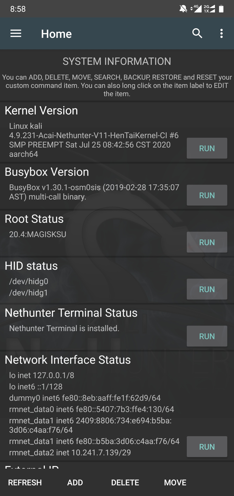
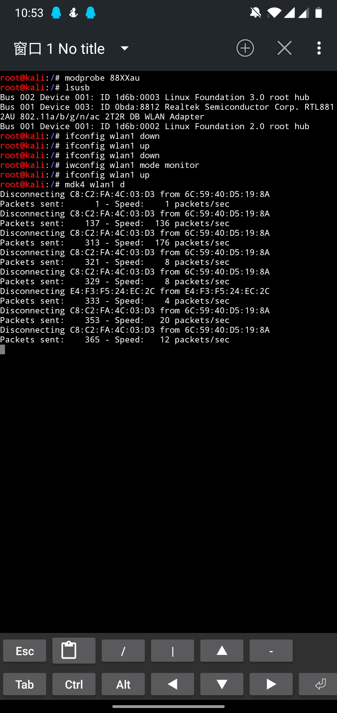

# Acai-Oneplus6-or-Oneplus6T-Nethunter-kernel
[README](README.md) | [中文文档](README_zh.md)

适用于一加6(T)的Nethunter内核，[源码](https://github.com/acai66/op6-op6t-nethunter-kernel)

## 内核信息
- 版本: V10
- 内核版本: 4.9.231
- 支持系统: 氢安卓10，理论也支持氧10
- 编译链: Clang11



### 当前已完成功能
1. HID补丁 (已测试)
2. 帧注入补丁 (已测试)
3. 添加部分usb网卡驱动 (已测试)
4. rtl8812au驱动 (5Ghz wifi)(已测试)
5. rtl8188eu驱动(未测试)
6. WireGuard (已测试)
7. PostgreSQL (已测试)
8. 支持nfs网络文件系统 (已测试)
9. USB rndis (已测试)
10. Amateur radio support
11. CAN bus support
12. IrDA(infrared) support
13. USB Serial Converter support
14. Patch system systemlessly (已测试)
15. 以及其他可能正常工作的设备驱动，(例如RTL-SDR、Hackrf、usb蓝牙) 


### Bugs
1. 测试中...


### TODO
1. 测试各功能
2. 尝试修复已知bug
3. 跟进内核源码更新

### 说明
1. 未在一加6t上测试，理论支持一加6t
2. 只测试了rtl8812au网卡，其余网卡未测试
3. 没有Hackrf、usb蓝牙设备，也未测试，如有测试可用的，请反馈
4. #### 如何安装?
    请确保你的系统为官方安卓10，并且已刷入twrp与magisk，然后在recovery模式下刷入最新发布内核即可。
5. #### 如何加载内核模块？
    使用`modprobe`命令加载内核模块，例如加载rtl8812au模块，运行`modprobe 88XXau`。
    更多模块请参考`/system/lib/modules/`下有哪些ko文件。
6. #### 如何进行HID测试？
    参考USB ARMY： https://forum.xda-developers.com/oneplus-5/development/burgerhunter-t3638810
    ```
    setprop sys.usb.config reset
    setprop sys.usb.config win,hid
    setprop sys.usb.config win,mass_storage
    setprop sys.usb.config win,rndis
    setprop sys.usb.config win,hid,mass_storage
    setprop sys.usb.config win,rndis,hid
    setprop sys.usb.config win,rndis,mass_storage
    setprop sys.usb.config win,rndis,hid,mass_storage
    setprop sys.usb.config mac,hid
    setprop sys.usb.config mac,mass_storage
    setprop sys.usb.config mac,ecm
    setprop sys.usb.config mac,hid,mass_storage
    setprop sys.usb.config mac,ecm,hid
    setprop sys.usb.config mac,ecm,mass_storage
    setprop sys.usb.config mac,ecm,hid,mass_storage
    ```
7. #### 如何切换网卡到监听模式？
    在测试`rtl8812au`时，使用`airmon-ng start wlan1`打开监听模式总是有异常，经过搜索测试发现运行如下命令即可打开监听模式
    ```
    ip link wlan1 down
    iw dev wlan1 set type monitor
    ip link wlan1 up
    ```

    

### Credits
- [fasheng](https://github.com/fasheng) for HID patches
- [simonpunk](https://forum.xda-developers.com/oneplus-5/development/burgerhunter-t3638810) for HID patches
- [johanlike(DJY)](https://github.com/johanlike) for wifi patches
- [Boos4721](https://github.com/Boos4721/op6_kernel) for kernel source 
- [osm0sis](https://github.com/osm0sis/AnyKernel3) for AnyKernel3
- [kimocoder](https://github.com/kimocoder) for help

